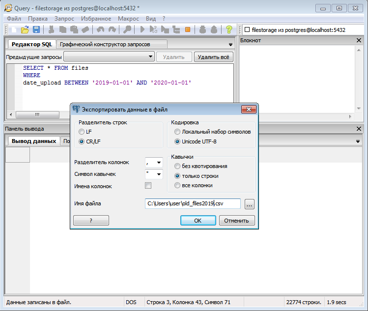

# Утилита очистки ФХ от файлов

Если процедура очистки ФХ от старых файлов не помогла, то:
1. подготовить CSV файл, аналогичный [примеру](./example.csv)
результат выборки из баз сохраняется как файл

2. скачать исполняемый файл для [Windows](https://github.com/YuriyGrinev/fscleaner/releases/download/v0.1/fscleaner-windows-amd64.exe) или [Linux](https://github.com/YuriyGrinev/fscleaner/releases/download/v0.1/fscleaner-linux-amd64)
3. запустить в термитале на хосте с ФХ
```bash
fscleaner -file example.csv
```